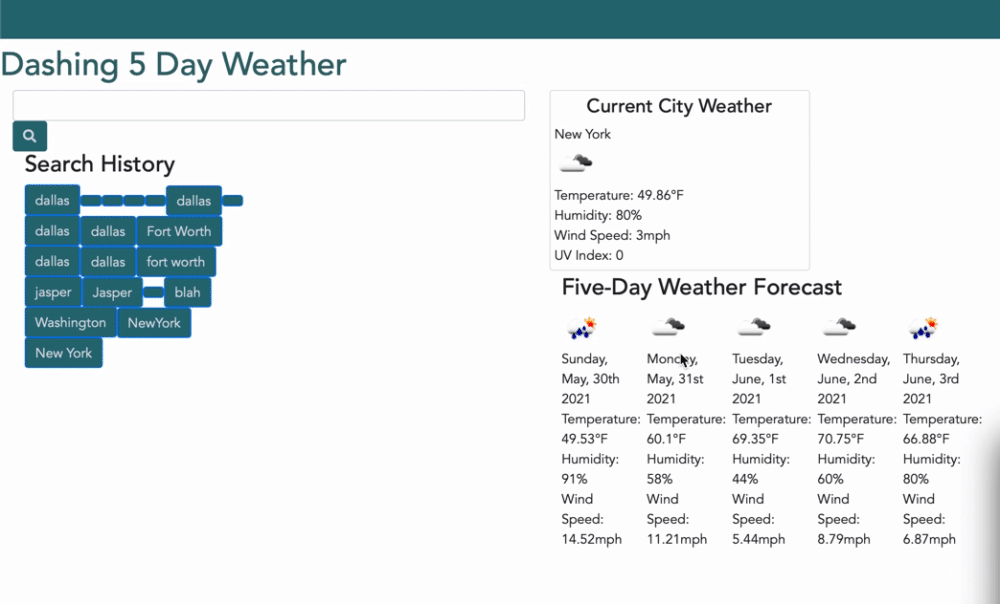

# Beautiful Day App

Plan Your Trip With Weather

## Description
Using the OpenWeather API to create a real-time weather dashboard users can go between cities that they searched for to see the data again. This app lists: date, temperature, hudity, wind speed, and a five day forecast.

## Installation
To view our code for this application, visit the GitHub Repository:

[Beautiful Day GitHub Repository](https://github.com/mirrorlessmind/BeautifulDay)

Visit the deployed site below:

[Beautiful Day Deployed Site](https://mirrorlessmind.github.io/BeautifulDay)

## Usage
Users will enter the name of the city that that would like to check the weather on. User will not get a search result without entering a valid cityEnter the name of the city for which you would like to see data. Users may need to alter their preferences for the Open Weather API to work on the Chrome Extension

## Reference
To learn more about this awesome API, go to their site:
[OpenWeather API](https://openweathermap.org/api)
